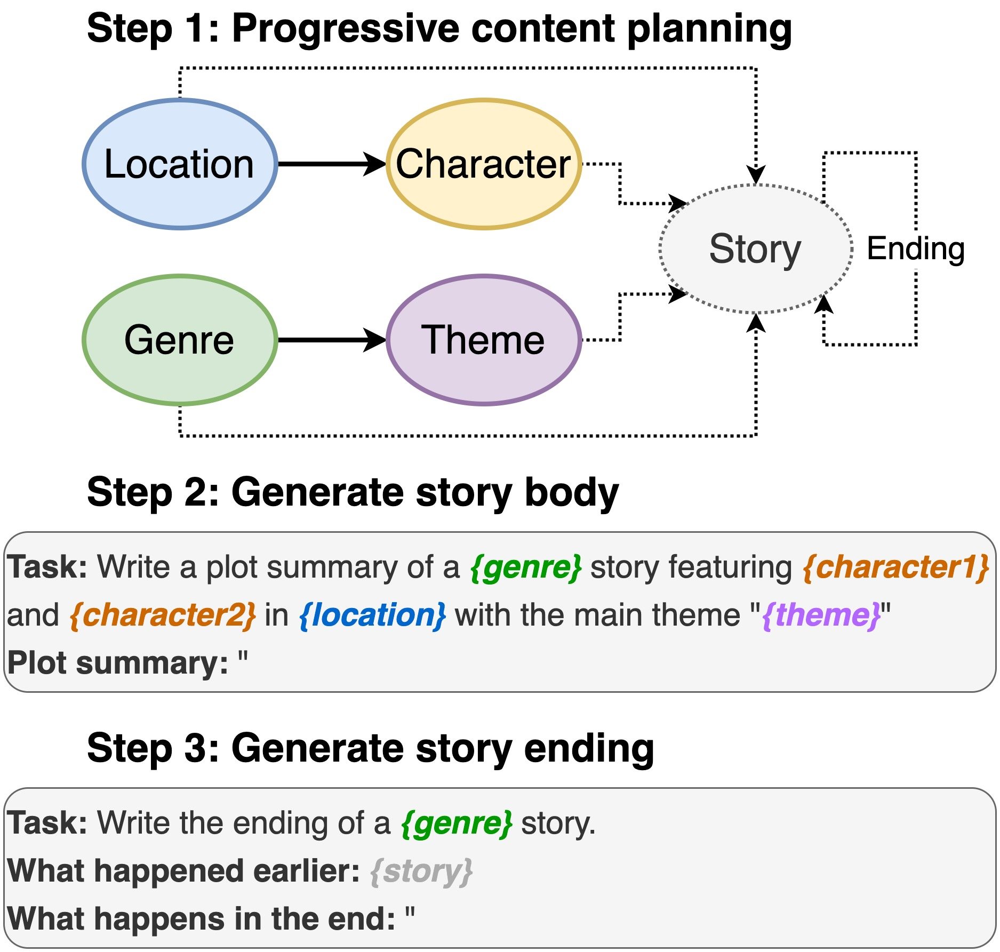

# ScratchPlot: Story Generation by Prompting Pre-Trained Language Models

This repository contains the code for [**Plot Writing From Pre-Trained Language Models**](https://arxiv.org/abs/2206.03021), to appear in INLG 2022. The paper introduces a method to first prompts a PLM to compose a content plan. Then, we generate the story’s body and ending conditioned on the
content plan. Furthermore, we take a generate-and-rank approach by using additional PLMs to rank the generated (story, ending) pairs.

<p align="center"></p>

This repo relies heavily on [D<small>INO</small>](https://github.com/timoschick/dino). Since we made some minor changes, 
we include the complete code for ease of use. 

## Usage

### 1. Generating plot elements

Including location, cast, genre and theme.

```bash
sh run_plot_static_gpu.sh
```

The content plan elements are generated once and stored. When generating the stories, the system samples from the offline-generated plot elements.

### 2. Generate the plot scene by scene

```bash
sh run_plot_dynamic_gpu_single.sh
```

### 3. Generate a batch of stories

```bash
sh run_plot_dynamic_gpu_batch.sh
```

### Note

- Some hyper-parameters are hard-coded in the bash scripts. You can modify them when needed. The most common ones are:
  - If you don't have a GPU, add  `--no_cuda` to all the commands that calls `dino.py`.
  - You can modify the number of entries. If your RAM is small (< 8GB), you might receive an OOM error. In such case, reduce the number of entries (at the cost of less diverse stories).
  - You can also modify the length of each generation.
  - While this paper introduces end-to-end content plan and story generation, you can also check the format of the content plan and then either write the content plan manually or curate the system generation.

## Setup

Requires Python3. Tested on Python 3.6 and 3.8.

```bash
pip3 install -r requirements.txt
```

```python
import nltk
nltk.download('punkt')
nltk.download('stopwords')

```

## 📕 Citation

If you make use of the code in this repository, please cite the following paper:
````
@inproceedings{jin-le-2022-plot,
    title = "Plot Writing From Pre-Trained Language Models",
    author = "Jin, Yiping  and Kadam, Vishakha and Wanvarie, Dittaya",
    booktitle = "Proceedings of the 15th International Natural Language Generation conference",
    year = "2022",
    address = "Maine, USA",
    publisher = "Association for Computational Linguistics"
}
````

If you use D<small>INO</small> for other tasks, please also cite the following paper:

````
@article{schick2020generating,
  title={Generating Datasets with Pretrained Language Models},
  author={Timo Schick and Hinrich Schütze},
  journal={Computing Research Repository},
  volume={arXiv:2104.07540},
  url={https://arxiv.org/abs/2104.07540},
  year={2021}
}
````